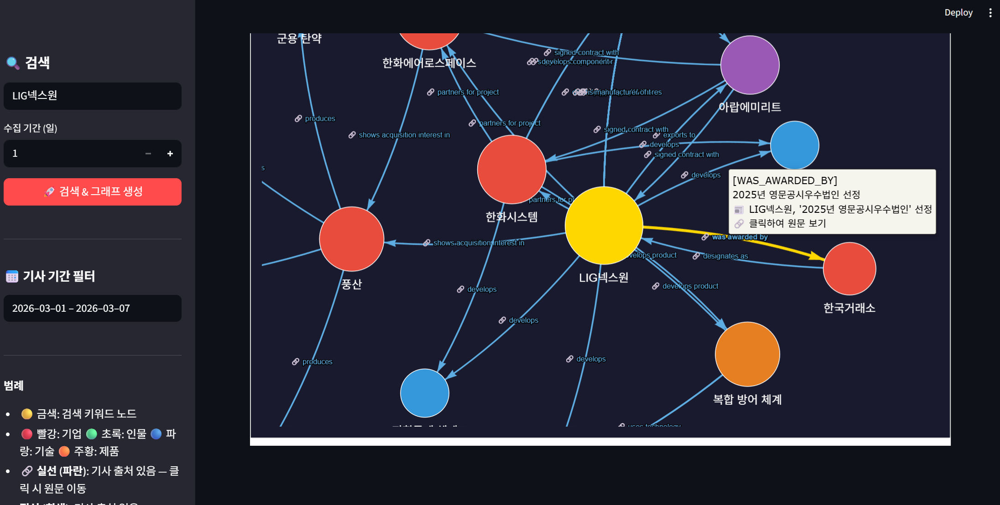
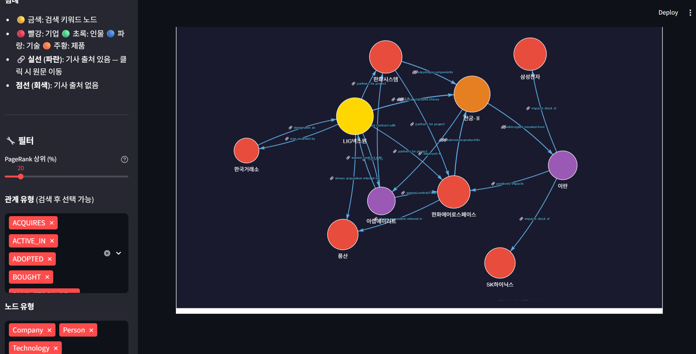

# 🌐 News Graph Pipeline

**본 프로젝트는 지식 그래프(Knowledge Graph) 및 Graph Database(Neo4j)의 실제 활용 방안을 모색하고 기술 가능성을 검증하기 위해 진행한 PoC(Proof of Concept) 용도의 개인 프로젝트입니다.**

파편화된 비정형 뉴스 데이터를 수집하여 의미 있는 지식 그래프(Knowledge Graph)로 구조화하고, 이를 인터랙티브하게 탐색할 수 있는 대시보드 시스템을 구축한 PoC 프로젝트입니다.

데이터 수집부터 LLM 기반의 엔티티 추출, Neo4j 적재, 그리고 PageRank 및 기간 필터링을 활용한 인사이트 도출까지 이어지는 **엔드 투 엔드(End-to-End) 그래프 데이터 파이프라인** 구현에 초점을 맞추고 있습니다.

## 📸 스크린샷 및 사용 예시


*(그림 1: 키워드 검색 및 지식 그래프 추출 결과 대시보드 구조)*


*(그림 2: 그림 1과 동일한 검색어에 대해 PageRank 필터를 적용하여, 가장 연관성(Centrality)이 높은 핵심 테마 노드만 선별한 뷰)*

## 🏗️ 아키텍처 및 구현 모듈

- **[Layer 1] Config & Schema (`src/configs/`)**:
  - `Pydantic` 스키마 템플릿을 통해 LLM 환각(Hallucination)을 막고 엄격하게 파싱된 노드/엣지(Entity & Relation) 데이터를 추출합니다.
- **[Layer 2] Data Crawlers (`src/core/crawlers/`)**:
  - 외부 데이터를 수집하고 LLM 비용 최적화를 위해 청크 단위로 클러스터링합니다. (현재 구현체: `naver_news.py`)
  - 영문 기사는 **LLM 자동 번역**을 통해 한국어로 변환 후 처리합니다.
- **[Layer 3] Data Processing (`src/core/utils/`)**:
  - 파편화된 엔티티(예: '삼성', '삼전')를 하나의 Dictionary 매핑 규칙으로 표준화하여 그래프의 신뢰성을 높입니다. (`entity_resolution.py`)
  - ⚠️ **(현재 버전의 한계 및 커스텀 가이드)**: 현재 버전은 하드코딩된 수동 Dictionary(Rule-based)에 100% 의존합니다. 사전에 정의되지 않은 새로운 키워드(예: '오픈AI', '소라') 검색 시 파편화가 발생할 수 있습니다. **자신만의 테마나 관심 종목을 추가하려면 `src/core/utils/entity_resolution.py` 내의 `ENTITY_MAP` 딕셔너리에 매핑 규칙을 직접 추가해야 합니다.**
- **[Layer 4] Graph Database & RAG (`src/graphs/`)**:
  - 정제된 데이터를 Neo4j에 멱등성(`MERGE`)을 지켜 **검색어별로 누적 적재**합니다. 재검색 시 마지막 처리 기사 이후의 신규 기사만 증분(Incremental) 업데이트합니다. (`neo4j_manager.py`)
  - 사용자의 자연어 질문을 Cypher 쿼리로 번역하는 RAG 챗봇 인터페이스도 제공합니다. (`graph_rag_bot.py`)
- **[Layer 5] User Interface (`apps/gui/`)**:
  - `Streamlit` 과 `Pyvis` 기반의 대화형 지식 그래프 대시보드입니다. (`app.py`)
  - **시계열 및 핵심 노드 필터링**: DB 쿼리 조합과 `NetworkX` 기반의 PageRank 알고리즘을 사용해, 특정 기간에 발생한 기사만 필터링하고 핵심 테마(PageRank 상위 N%)만 시각화합니다.
  - **관계 및 직관적 시각화**: 기사 출처가 있는 엣지는 실선과 `🔗` 라벨로 표현하여, 클릭 시 즉각 원문을 검증할 수 있습니다. 노드/엣지 유형별 다중 옵션 필터링을 지원합니다.

## 🚀 빠른 시작 가이드 (Quick Start)

### 1단계. 사전 세팅

1. **Neo4j Desktop 설치 및 데이터베이스 실행**
   1. [Neo4j Desktop 다운로드 페이지](https://neo4j.com/download/)에서 OS에 맞는 설치 파일을 받아 설치합니다.
   2. Neo4j Desktop을 실행 후 **"New Project" → "Add → Local DBMS"** 를 클릭합니다.
   3. Name은 자유롭게, Password는 `.env`에 등록할 비밀번호로 설정한 뒤 **"Create"** 를 클릭합니다.
   4. 생성된 DBMS 옆 **"Start"** 버튼을 클릭하여 데이터베이스를 실행합니다.
   5. (선택) **"Open"** 버튼으로 Neo4j Browser(`http://localhost:7474`)에 접속해 정상 동작을 확인합니다.

2. **Python 가상환경 구축 및 의존성 설치**
   최신 버전의 Python이 설치되어 있어야 합니다. (3.10 이상 권장)
   ```bash
   # 가상환경 생성 (최초 1회)
   python -m venv venv

   # 가상환경 활성화 (Windows)
   .\venv\Scripts\activate

   # 가상환경 활성화 (macOS/Linux)
   source venv/bin/activate

   # 필수 패키지 설치
   pip install -r requirements.txt
   ```

3. **환경 변수(.env) 설정**
   루트 디렉토리에 `.env` 파일을 생성하고 다음 API 키를 등록:
   - **네이버 검색 API 키** 발급 방법: [docs/naver_api_setup.md](docs/naver_api_setup.md) 참고
   - **Google Gemini API 키** 발급: [Google AI Studio](https://aistudio.google.com/app/apikey)
   ```env
   NAVER_CLIENT_ID=your_id
   NAVER_CLIENT_SECRET=your_secret
   GOOGLE_API_KEY=your_gemini_api_key
   NEO4J_PASSWORD=your_password
   NEO4J_URI=bolt://localhost:7687
   ```

### 2단계. 대시보드 실행

> ⚠️ **LLM 비용 주의**
> 검색 1회 실행 시 수집 기간(일수)에 따라 **수백 원 ~ 그 이상의 Gemini API 비용**이 발생할 수 있습니다.
> 기사 건수가 많을수록, 수집 기간이 길수록 비용이 증가합니다. 테스트 시에는 **수집 기간을 짧게** 설정하는 것을 권장합니다.
> 증분 업데이트 기능 덕분에 **재검색 시에는 신규 기사분만 처리**되어 같은 검색어에 대해 새로 검색하더라도 비용이 누적되지 않도록 처리했습니다.

```bash
streamlit run apps/gui/app.py
```
대시보드에서 키워드를 입력하면 뉴스 수집 → LLM 추출 → DB 적재가 **자동으로** 실행됩니다.

> **증분 업데이트**: 동일 키워드를 재검색하면 마지막으로 처리된 기사 이후의 신규 기사만 수집합니다. DB는 초기화되지 않고 누적됩니다.

---

## 🗄️ Neo4j 데이터 스키마

```
(:Keyword {name, last_updated})
    │
    └──[:HAS_ARTICLE]──▶ (:Article {url, title, published_at, keyword})

(:Company / :Person / :Technology / :Product / :Country)
    └──[:RELATION_TYPE {description, source_article, source_url}]──▶ (:Entity)
```

- **Keyword**: 검색어별 마지막 업데이트 시각 추적
- **Article**: 기사 URL을 PK로 중복 방지 + 증분 업데이트 기준점
- **Entity 계열**: 키워드를 가리지 않고 공유 → 크로스-키워드 연결망 분석 가능

---

## 📅 향후 개선 과제 (To-Do List)

- [x] **시계열 연결망 분석 및 UI 고도화 (Time-series & UI Advanced)**
  - Dashboard에 '날짜/기간 슬라이더', 'PageRank 필터', '노드/엣지 유형 필터' 등을 탑재하여 특정 시점 내 핵심 연결 양상만 빠르고 직관적으로 분석 완료
- [ ] **데이터 소스 다변화 (Diversified Primary Sources)**
  - 글로벌 금융정보 API(Bloomberg, Yahoo Finance) 연동 프로바이더 모듈 추가 작성
- [ ] **AI 기반 엔티티 정규화 고도화 (Advanced Entity Resolution)**
  - 엔티티의 파편화('삼성', '삼전', '삼성전자')를 막고 단일 노드로 병합하기 위해 두 가지 방안(접근법)을 병렬로 검토하여 고도화합니다.
    - **1) LLM-Native Approach (Agentic Workflow)**: `LangGraph` 기반의 엔티티 매핑 에이전트 도입. 추출된 일일 엔티티 목록 전체를 LLM에 전달한 뒤 "의미상 동일한 대상을 그룹화하고 대표 명칭을 하나로 통일하라"는 자율 Task를 부여하여, 모델이 직접 동적 사전(Dynamic Dictionary)을 구축하고 반환하도록 설계합니다. (유지보수가 편하나 비용이 다소 높음)
    - **2) Hybrid Pipeline (Cost-Effective)**: 1차로 초경량 로컬 임베딩 모델(Sentence Transformers 등)을 이용해 엔티티들 간의 벡터 코사인 유사도(Cosine Similarity)를 계산해 초기 군집화(클러스터링)를 수행하고, 2차로 임계치 경계에 있는 애매한 군집 결과만 선별하여 LLM(Gemini/GPT-4o)에게 결정적 검증을 요청하는 방식으로 비용과 속도, 정확도를 모두 잡는 파이프라인을 구축합니다.
- [ ] **비용 최적화 라우팅 아키텍처 (Cost Routing Architecture)**
  - 문서의 중요도에 따라 노이즈 필터링(Drop) → sLM/NER(저비용 추출) → GPT-4o/Gemini(심층 추출)로 분기하는 3-Tier 라우팅 도입으로 LLM API 비용 최소화
- [ ] **정교한 관계 속성 및 가중치 추출 (Rich Edge Attributes)**
  - 단순 관계 유형을 넘어, 뉴스 문맥을 분석해 관계의 감성(긍정/부정)과 파급 강도(Weight)를 엣지 속성으로 반영하여 동력학적 시각화 및 분석 지원
- [ ] **동적 인사이트 요약 리포트 자동 생성 (Insight Generation)**
  - 특정 기간에 형성된 군집(Sub-graph) 데이터 전체를 LLM에 전달하여 "최근 특정 산업 부문에 형성된 신규 테마 이슈"를 텍스트로 요약 및 브리핑 해주는 리포트 자동 발행
- [ ] **도메인 특화 온톨로지(Ontology) 모델링**
  - 명시된 엔티티뿐만 아니라 'HBM3E → 메모리반도체 → 시스템반도체'와 같은 상하위 범주 트리를 도입하여, 의미(Semantic) 기반의 거시적 연결망 탐색 및 쿼리 고도화 달성
