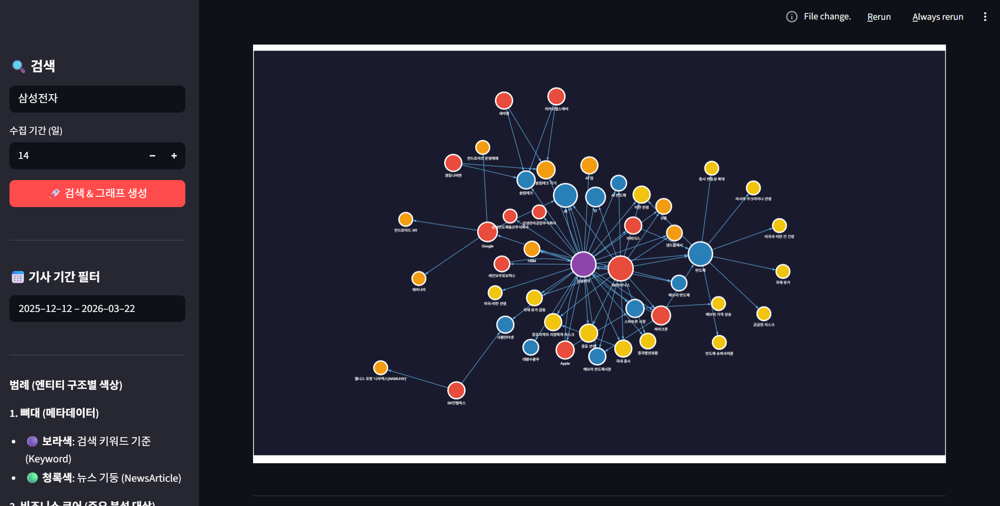
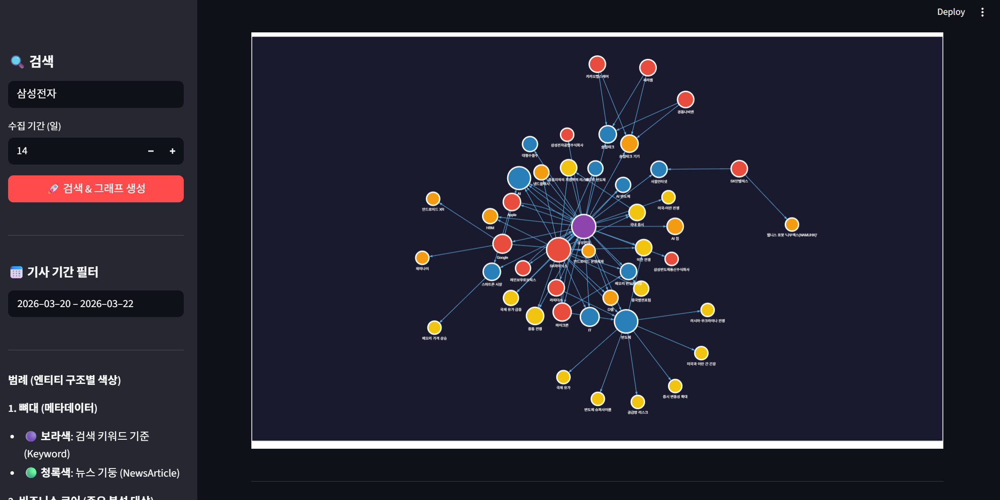
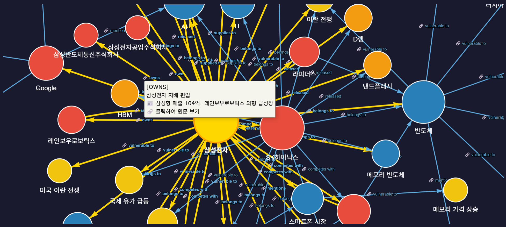
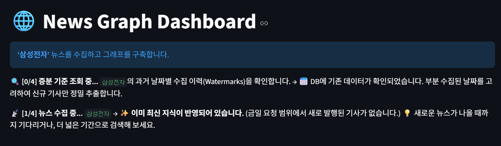
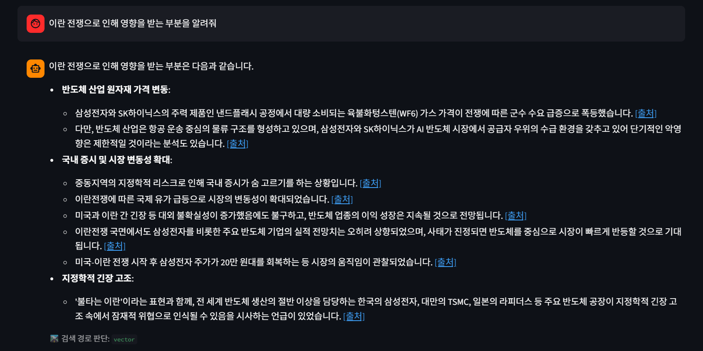
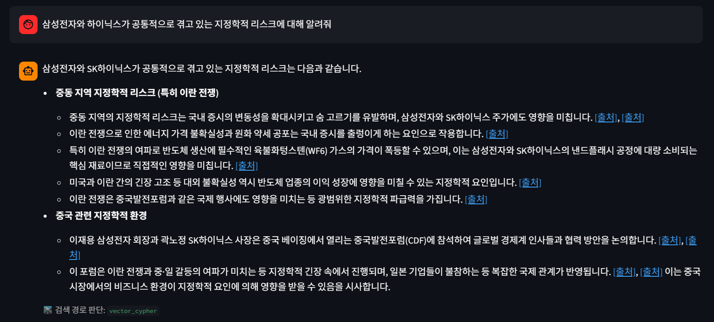

# 🌐 News Graph Pipeline

**본 프로젝트는 지식 그래프(Knowledge Graph) 및 Graph Database(Neo4j)의 실제 활용 방안을 모색하고 기술 가능성을 검증하기 위해 진행한 PoC(Proof of Concept) 용도의 개인 프로젝트입니다.**

파편화된 비정형 뉴스 데이터를 수집하여 의미 있는 지식 그래프(Knowledge Graph)로 구조화하고, 이를 인터랙티브하게 탐색할 수 있는 대시보드 시스템을 구축한 PoC 프로젝트입니다.

데이터 수집부터 LLM 기반의 엔티티 추출, Neo4j 적재, PageRank 및 기간 필터링을 활용한 인사이트 도출, 그리고 Graph RAG 챗봇까지 이어지는 **엔드 투 엔드(End-to-End) 그래프 데이터 파이프라인** 구현에 초점을 맞추고 있습니다.

## 📸 스크린샷 및 사용 예시

### 1️⃣ 전체 대시보드 – 지식 그래프 탐색

키워드를 입력하면 뉴스 수집과 LLM 기반 엔티티 추출이 자동으로 실행되고, 결과가 인터랙티브한 지식 그래프로 시각화됩니다.  
노드의 크기는 연결 수(Centrality), 색상은 엔티티 유형(기업·산업·거시사건 등)을 나타냅니다.


*▲ '삼성전자' 키워드로 14일치 뉴스를 수집한 결과. 보라색 Keyword 노드를 중심으로 관련 기업·산업·거시사건 노드들이 방사형으로 배치됩니다.*

---

### 2️⃣ 기사 기간 필터 – 단기 뉴스만 선별

사이드바의 **기사 기간 필터**를 좁히면, Neo4j 쿼리가 실시간으로 갱신되어 해당 기간의 기사에서 유래한 관계만 표시됩니다.


*▲ 2026-03-20 ~ 2026-03-22 3일치만 필터링한 뷰. 노드 수가 줄어들며 최근 이슈에 집중한 연결망이 드러납니다.*

---

### 3️⃣ 엣지 클릭 – 원문 뉴스 툴팁 및 링크

파란색 엣지(출처가 명확한 관계)를 클릭하면 관계 유형, 설명, 출처 기사 제목이 팝업으로 표시되고 원문 링크로 바로 이동할 수 있습니다.


*▲ [OWNS] 관계 엣지를 클릭한 화면. "삼성전자 지배 편입" 맥락과 원문 기사 제목이 함께 표시됩니다.*

---

### 4️⃣ 스마트 증분 수집 – 중복 없는 워터마크 기반 업데이트

이미 수집된 키워드를 재검색하면, 날짜별 마지막 수집 시각(Watermark)을 확인하여 신규 기사만 처리합니다.  
기존 DB가 최신 상태라면 LLM 호출 없이 즉시 종료합니다.


*▲ 이미 최신 지식이 반영된 상태에서 재검색 시 "이미 최신 지식이 반영되어 있습니다" 안내가 표시됩니다.*

---

### 5️⃣ Graph RAG 챗봇 – 지식 그래프 기반 질의응답

수집된 뉴스 데이터를 바탕으로 자연어로 질문하면, Vector / Text-to-Cypher / Hybrid 3가지 경로 중 최적의 경로를 자동 선택하여 답변을 생성합니다.  
각 문장 끝에는 출처 링크가 첨부되어 즉시 원문을 확인할 수 있습니다.


*▲ "이란 전쟁으로 인해 영향을 받는 부분을 알려줘" 질문에 대한 답변. 각 문장마다 클릭 가능한 [출처] 링크가 붙어 있습니다.*


*▲ "삼성전자와 하이닉스가 공통적으로 겪고 있는 지정학적 리스크" 질문. `vector_cypher` 경로를 선택하여 그래프 관계 기반 답변을 생성합니다.*


## 🗺️ 지식 그래프 온톨로지

프로젝트가 추출하고 저장하는 노드·관계 구조(온톨로지)는 아래 다이어그램을 참고하세요.


### 🤖 Graph RAG Agent Workflow (LangGraph)

프로젝트의 핵심 검색 엔진은 `LangGraph`를 통해 구성된 다중 경로 에이전트 아키텍처를 가집니다.


> 📄 전체 아키텍처 상세 설명 → [docs/architecture.md](docs/architecture.md)

## 🏗️ 아키텍처 및 구현 모듈

- **[Layer 1] Config & Schema (`src/configs/`)**:
  - `Pydantic` 스키마 템플릿을 통해 LLM 환각(Hallucination)을 막고 엄격하게 파싱된 노드/엣지(Entity & Relation) 데이터를 추출합니다.
  - 추출 대상 엔티티: `Company`, `Industry`, `MacroEvent`, `Product`
  - 엔티티 동의어 매핑은 코드 외부의 `entity_aliases.json`으로 관리합니다.
- **[Layer 2] Data Crawlers (`src/core/crawlers/`)**:
  - 신뢰 언론사 화이트리스트(`chosun.com`, `yna.co.kr`, `hankyung.com` 등) 기사만 선별합니다.
  - TF-IDF + 코사인 유사도 기반으로 중복 기사를 제거하고, 기사를 **10개 단위의 배치(Batch)**로 클러스터링합니다. (`naver_news.py`)
  - **전역적 기사 고유 인덱싱**: 여러 뉴스가 검색될 때 리트리버가 `[Article_1]`, `[Article_2]` 등으로 기사 번호를 고유하게 재부여하여 LLM의 출처 혼선을 방지합니다.
  - 수집 기간은 **달력 일(日) 기준**으로, 1일=오늘, 5일=오늘 포함 과거 5일. (최대 100일)
- **[Layer 3] Data Processing (`src/core/utils/`)**:
  - 파편화된 엔티티(예: '삼성', '삼전')를 `entity_aliases.json` 매핑 규칙으로 표준화합니다. (`entity_resolution.py`)
- **[Layer 4] Graph Database & RAG (`src/graphs/`, `src/nodes/`)**:
  - 정제된 데이터를 Neo4j에 멱등성(`MERGE`)을 지콌 **검색어별로 누적 적재**합니다.
  - **워터마크(Watermark) 기반 증분 수집:** `Keyword` 노드에 날짜별 마지막 수집 시각을 저장하여, 재검색 시 **실제로 수집된 기사의 날짜만** 업데이트하여 누락 없이 신규 기사를 추가 수집합니다. (`neo4j_manager.py`)
  - `NewsBatch` 노드와 `NewsArticle` 노드를 `[:HAS_SOURCE]`로 명시적으로 연결하여 데이터 출처(Provenance)를 보존합니다.
  - Vector / Text-to-Cypher / Hybrid 3가지 경로를 가진 LangGraph 기반 RAG 에이전트를 제공합니다. (`hybrid_rag.py`)
- **[Layer 5] User Interface (`apps/gui/`)**:
  - `Streamlit` 과 `Pyvis` 기반의 대화형 지식 그래프 대시보드입니다. (`app.py`)
  - **레이아웃**: 상단에 지식 그래프, 하단에 Graph RAG 채팅창을 수직 배치합니다.
  - **엄격한 날짜 필터 기반 그래프**: 날짜 슬라이더를 조정하면 Neo4j 쿼리에 직접 반영하여 해당 기간 기사에서 유래한 관계만 그래프로 표시합니다.
  - **시계열 및 핵심 노드 필터링**: PageRank 상위 N%, 기간 슬라이더, 노드/엣지 유형 필터링 지원.
  - **정밀 출처 및 새 창 열기**: 답변의 각 문장 끝에 클릭 가능한 마크다운 링크를 생성(`[출처](URL)`)하며, 클릭 시 새 탭에서 원문 기사가 열리도록 지원합니다.
  - **채팅 내역**: 질문-답변을 한 세트로 묶어 최신 대화가 위에 정렬됩니다.

## 🚀 빠른 시작 가이드 (Quick Start)

### 1단계. 사전 세팅

1. **Neo4j Desktop 설치 및 데이터베이스 실행**
   1. [Neo4j Desktop 다운로드 페이지](https://neo4j.com/download/)에서 OS에 맞는 설치 파일을 받아 설치합니다.
   2. Neo4j Desktop을 실행 후 **"New Project" → "Add → Local DBMS"** 를 클릭합니다.
   3. Name은 자유롭게, Password는 `.env`에 등록할 비밀번호로 설정한 뒤 **"Create"** 를 클릭합니다.
   4. 생성된 DBMS 옆 **"Start"** 버튼을 클릭하여 데이터베이스를 실행합니다.
   5. (선택) **"Open"** 버튼으로 Neo4j Browser(`http://localhost:7474`)에 접속해 정상 동작을 확인합니다.

2. **Python 가상환경 구축 및 의존성 설치**
   최신 버전의 Python이 설치되어 있어야 합니다. (3.10 이상 권장)
   ```bash
   # 가상환경 생성 (최초 1회)
   python -m venv venv

   # 가상환경 활성화 (Windows)
   .\venv\Scripts\activate

   # 가상환경 활성화 (macOS/Linux)
   source venv/bin/activate

   # 필수 패키지 설치
   pip install -r requirements.txt
   ```

3. **환경 변수(.env) 설정**
   루트 디렉토리에 `.env` 파일을 생성하고 다음 API 키를 등록:
   - **네이버 검색 API 키** 발급 방법: [docs/naver_api_setup.md](docs/naver_api_setup.md) 참고
   - **Google Gemini API 키** 발급: [Google AI Studio](https://aistudio.google.com/app/apikey)
   ```env
   NAVER_CLIENT_ID=your_id
   NAVER_CLIENT_SECRET=your_secret
   GOOGLE_API_KEY=your_gemini_api_key
   NEO4J_PASSWORD=your_password
   NEO4J_URI=bolt://localhost:7687
   ```

### 2단계. 대시보드 실행

> ⚠️ **LLM 비용 주의**
> 검색 1회 실행 시 수집 기간(일수)에 따라 **수백 원 ~ 그 이상의 Gemini API 비용**이 발생할 수 있습니다.
> 기사 건수가 많을수록, 수집 기간이 길수록 비용이 증가합니다. 테스트 시에는 **수집 기간을 짧게** 설정하는 것을 권장합니다.
> 증분 업데이트 기능 덕분에 **재검색 시에는 신규 기사분만 처리**되어 같은 검색어에 대해 새로 검색하더라도 비용이 누적되지 않도록 처리했습니다.

```bash
streamlit run apps/gui/app.py
```
대시보드에서 키워드를 입력하면 뉴스 수집 → LLM 추출 → DB 적재가 **자동으로** 실행됩니다.

> **달력 일(日) 기반 증분 업데이트**: 동일 키워드를 재검색하면 이미 수집 완료된 날짜는 건너뛰고, 당일처럼 부분적으로 수집된 날짜는 해당 시각 **이후의 신규 기사만** 수집합니다. DB는 초기화되지 않고 누적됩니다.

---


| 노드 | 역할 |
|------|------|
| `Keyword` | 검색어 추적, 날짜별 마지막 수집 시각(Watermark) 저장 |
| `NewsArticle` | 기사 URL(PK)로 중복 방지 + 증분 기준점 |
| `NewsBatch` | 10개 기사 단위 LLM 입력 배치. 벡터 검색(RAG)의 기본 단위 |
| `Entity` 계열 | `Company`, `Industry`, `MacroEvent`, `Product` 타입. 키워드 무관 공유 → 크로스-키워드 분석 |

---

## 📅 향후 개선 과제 (To-Do List)

- [x] **시계열 연결망 분석 및 UI 고도화 (Time-series & UI Advanced)**
  - Dashboard에 '날짜/기간 슬라이더', 'PageRank 필터', '노드/엣지 유형 필터' 등을 탑재하여 특정 시점 내 핵심 연결 양상만 빠르고 직관적으로 분석 완료
- [x] **신뢰 언론사 화이트리스트 필터 (Trusted Source Filtering)**
  - 주요 언론사 도메인만 허용하도록 필터링
- [x] **Graph RAG 챗봇 (Graph RAG Chatbot)**
  - Vector / Text-to-Cypher / Hybrid 3가지 경로, RAG 하이라이트, 출처 링크, 채팅 내역 정렬
- [x] **워터마크(Watermark) 기반 스마트 증분 수집 (Smart Incremental Fetch)**
  - 키워드별 날짜별 마지막 수집 시각을 Neo4j에 저장, 실제 수집된 기사의 날짜만 업데이트하여 누락 없는 증분 수집 구현
- [x] **엔티티 별칭 외부 관리 (External Entity Alias Config)**
  - `entity_aliases.json`으로 코드 수정 없이 동의어 매핑 추가 가능\
- [x] **노드 스타일 통일 (Node Style Unification)**
  - 모든 노드를 원형 스타일로 통일하고 엔티티 계층에 맞는 테마 색상 적용. `NewsArticle` 노드는 기본적으로 필터에서 허용 해제
- [x] **엄격한 날짜 필터 기반 그래프 (Strict Date-Filtered Graph)**
  - 날짜 필터를 그래프 쿼리에 직접 반영하여 선택된 기간의 기사에서 유래한 관계만 시각화 (ꭐ, 날짜 외 조건으로 인한 데이터 오염 제거)
- [x] **기사 단위 배치처리 + 출처 정밀화 (Article-level Batch & Precision Citation)**
  - 기사 10개 단위 배치, `[Article_N]` ID 부여로 LLM이 각 문장의 출처를 명시하도록 강제. 답변에 인용된 기사만 정밀하게 출처로 표시
- [x] **Cypher Injection 방어 + 피드백 루프 (Cypher Validator with Feedback Loop)**
  - `text2cypher` 경로에 `cypher_validator` 노드 추가: 블랙리스트 키워드 차단 + `EXPLAIN`으로 문법 사전 검증
  - 검증 실패 시 최대 3회 재시도, 3회 초과 시 `generator` 생략 후 에러 메시지를 직접 반환
- [ ] **엔티티 별칭 설정 변경 시 노드 자동 병합 (Neo4j Sync)**
  - `entity_aliases.json`의 변경 사항을 감지하여 `apoc.refactor.mergeNodes` 기반 자동 DB 리팩토링
- [ ] **AI 기반 엔티티 정규화 고도화 (Advanced Entity Resolution)**
  - 임베딩 기반 군집화 + LLM 검증 하이브리드 파이프라인
- [ ] **정교한 관계 속성 및 가중치 추출 (Rich Edge Attributes)**
  - 관계 감성(긍정/부정) 및 파급 강도(Weight)를 엣지 속성으로 반영
- [ ] **동적 인사이트 요약 리포트 자동 생성 (Insight Generation)**
  - 특정 기간 Sub-graph를 LLM에 전달하여 신규 테마 이슈 브리핑 자동 발행
- [ ] **도메인 특화 온톨로지(Ontology) 모델링 고도화**
  - 'HBM3E → 메모리반도체 → 시스템반도체'와 같은 상하위 범주 트리 도입
- [ ] **감성 점수(Sentiment Score) 기반 분석 및 시각화**
  - LLM을 통한 엔티티별 감성 추출 도입 및 대시보드 내 노드 색상/크기 반영

