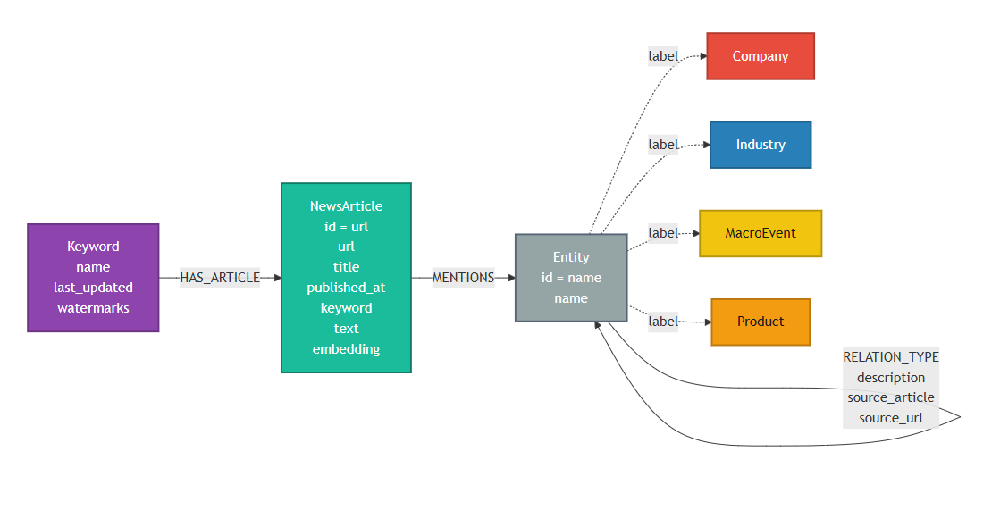
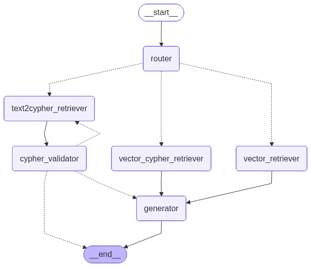

# 🏢 News Graph Pipeline - Architecture Document

이 문서는 `News Graph Pipeline` 프로젝트의 전체 시스템 아키텍처 및 핵심 모듈의 동작 원리를 설명합니다. 파편화된 비정형 뉴스 데이터를 수집하여 의미 있는 지식 그래프(Knowledge Graph)로 구조화하고, 이를 인터랙티브하게 탐색할 수 있는 엔드 투 엔드(End-to-End) 데이터 파이프라인 시스템을 구축하는 데 초점을 맞추고 있습니다.

---

## 🗺️ 지식 그래프 온톨로지

프로젝트에서 사용하는 Neo4j 노드/관계 스키마는 아래 온톨로지 다이어그램을 참고하세요.



---

## 🤖 Graph RAG Agent Workflow (LangGraph)

프로젝트의 핵심 검색 엔진은 `LangGraph`를 통해 구성된 다중 경로(Multi-path) 에이전트 아키텍처를 가집니다. 사용자의 질문 의도에 따라 가장 적합한 검색 전략을 동적으로 선택합니다.



---

## 🏗️ 1. High-Level Architecture Overview

시스템은 유지보수성과 확장성을 보장하기 위해 각 역할이 명확히 분리된 **디커플링(Decoupling)** 아키텍처를 따르고 있습니다. 전반적인 데이터 흐름은 다음과 같습니다.

1. **Data Ingestion (크롤링):** 신뢰 언론사(화이트리스트) 기사만 선별 수집합니다. 수집 기간은 달력 일(日) 기준으로, 1일이면 '오늘', 5일이면 '오늘 포함 과거 5일'입니다. (최대 100일)
2. **Watermark 기반 증분 처리:** 각 키워드별로 날짜별 마지막 수집 시각(Watermark)을 Neo4j에 저장합니다. 재검색 시 이미 수집 완료된 날짜는 건너뛰고, 부분 수집된 날짜(당일 등)는 해당 시각 이후 기사만 신규 수집합니다.
3. **Deduplication & Filtering:** TF-IDF + 코사인 유사도 기반으로 날짜별 유사 기사를 제거하고, 하루 최대 기사 수를 초과 시 균등 샘플링합니다.
4. **Article-level Embedding:** 각 기사를 독립적인 단위로 벡터 임베딩하여 `NewsArticle` 노드에 저장합니다. 이를 통해 기사 단위의 정밀한 벡터 검색이 가능합니다.
5. **Entity Resolution (정규화):** 추출된 엔티티의 동의어를 `entity_aliases.json` 매핑 규칙으로 표준어로 병합합니다.
6. **Graph Construction (증분 적재):** 정제된 엔티티와 관계 데이터를 Neo4j에 **MERGE 방식으로 누적 적재**합니다. 기사와 엔티티를 `[:MENTIONS]` 관계로 직접 연결합니다.
7. **Visualization & Analytics (시각화 및 분석):** 날짜 필터를 그래프 데이터베이스 쿼리에 직접 반영하여, 선택한 기간 내 기사에서 추출된 관계만 그래프로 시각화합니다.
8. **Graph RAG 챗봇:** 자연어 질문을 받아 Vector / Text-to-Cypher / Hybrid 방식으로 지식 그래프를 검색합니다. 검색된 `NewsArticle` 노드에서 URL을 직접 추출하여 **[참조 링크 매핑 테이블]**을 생성하고 100% 정확한 출처 정보를 제공합니다.

---

## 📦 2. Core Modules & Directory Structure

### `src/configs/` (Layer 1: Config & Schema)

* **`schema.py`:** `Pydantic`을 활용하여 추출될 그래프 데이터의 스키마(`Entity`, `Relation`, `GraphData`)를 엄격하게 정의합니다.
  * 추출 대상 엔티티 타입: `Company`, `Industry`, `MacroEvent`, `Product`
  * LLM 환각(Hallucination) 방지 및 정규화된 JSON 출력 강제
* **`settings.py`:** 파이프라인 전체에서 사용하는 **모든 튜닝 파라미터를 한 곳에서 관리**합니다.
  * LLM 모델명 (`LLM_MODEL`), 병렬 호출 수 (`LLM_MAX_WORKERS`), 배치 크기 (`BATCH_SIZE`)
  * 페이지네이션 기준 (`DAYS_BACK_PER_PAGE`, `MAX_PAGES`)
  * 유사 기사 필터 (`MAX_ARTICLES_PER_DAY`, `SIMILARITY_THRESHOLD`)
  * 그래프 표시 설정 (`GRAPH_QUERY_LIMIT`, `GRAPH_HOP_DEPTH`)
* **`entity_aliases.json`:** 엔티티 동의어 매핑 규칙을 코드 외부의 JSON 파일로 관리합니다. 코드 수정 없이 새로운 매핑을 추가할 수 있습니다.

### `src/core/crawlers/` (Layer 2: Data Crawlers)

* **`base_provider.py`:** Bloomberg, Yahoo Finance, DART 등 다양한 데이터 프로바이더를 수용할 수 있도록 `fetch_data` / `cluster_data` 추상 인터페이스를 정의합니다.
* **`naver_news.py`:** 네이버 뉴스 API 구현체입니다. 주요 기능은 다음과 같습니다.
  * `ALLOWED_NEWS_DOMAINS`: 수집 허용 언론사 도메인 화이트리스트 (`chosun.com`, `yna.co.kr`, `hankyung.com` 등).
  * **달력 일(日) 기반 수집 범위:** `days_back=1`이면 오늘 0시부터, `days_back=5`이면 4일 전(오늘 포함 5일) 0시부터 수집을 시작합니다. 최대 100일까지 설정 가능합니다.
  * **워터마크 기반 증분 처리:** 애플리케이션(`app.py`)에서 이미 수집된 날짜의 정확한 시각이 전달되면, 그 시각 이후에 발행된 기사만 신규 수집합니다.
  * `filter_similar_articles()`: 날짜별로 기사를 묶고, 제목 TF-IDF 코사인 유사도 ≥ `SIMILARITY_THRESHOLD`(기본 0.5)인 기사를 중복으로 판별합니다. 중복 제거 후에도 하루 `MAX_ARTICLES_PER_DAY`(기본 100건) 초과 시 균등 샘플링합니다.
  * `cluster_data(batch_size=10)`: 허용 도메인 기사만 포함하고 영문 기사를 제외한 후, 10개씩 묶어 하나의 텍스트 배치(Batch)로 병합합니다. 각 기사에는 `[Article_1]`~`[Article_N]` 형태의 고유 ID를 부여하여 LLM이 출처를 명확히 추적할 수 있도록 합니다.
  * `get_article_metadata()`: URL / 제목 / 발행일 메타데이터를 추출하여 Neo4j `NewsArticle` 노드 저장에 활용합니다.

### `src/core/utils/` (Layer 3: Data Processing & Entity Resolution)

* **`entity_resolution.py`:** 데이터의 파편화를 막기 위한 핵심 모듈입니다. '삼전', '삼성물산', 'Samsung' 등 다양한 형태로 등장하는 엔티티를 하나의 일관된 표준어로 정규화합니다.
  * 매핑 규칙은 코드가 아닌 `src/configs/entity_aliases.json`에서 외부 로드합니다.

### `src/graphs/` (Layer 4: Graph Database & RAG)

* **`neo4j_manager.py`:** Neo4j 적재를 담당하는 핵심 클래스입니다.
  * `get_keyword_watermarks(keyword)`: 키워드별 날짜별 마지막 수집 시각(Watermark)을 JSON 문자열로 반환합니다. 증분 처리의 기준점으로 사용됩니다.
  * `update_keyword_watermarks(keyword, watermarks)`: 수집이 완료된 기사의 실제 발행일을 기준으로 날짜별 워터마크를 갱신합니다. **실제로 기사를 수집한 날짜만** 업데이트하여 미래 재검색 시 누락이 발생하지 않도록 합니다.
  * `upsert_articles(keyword, articles)`: 기사를 `NewsArticle` 노드로 저장하고 `Keyword` 노드와 연결합니다.
  * `load_graph_data(graph_data, batch_text)`: 기별 텍스트를 개별적으로 임베딩하여 `NewsArticle`에 저장하고, 추출된 엔티티와 관계를 `[:MENTIONS]` 등으로 직접 연결합니다.
  * `create_vector_index()`: `NewsArticle` 노드의 임베딩을 저장하는 벡터 인덱스(`article_embedding`, 3072차원)를 생성합니다.
* **`state.py`:** LangGraph에서 사용하는 `AgentState`를 정의합니다. 질문, 라우팅 결정, 추출된 엔티티, Cypher 쿼리 및 결과, 대화 기록(`chat_history`), 재시도 횟수(`retry_count`), 검증 실패 시 에러 메시지(`final_answer`), 그리고 **기사 ID와 URL 매핑 테이블(`source_links`)**을 관리합니다.
* **`hybrid_rag.py`:** `router`를 필두로 Vector / Text-to-Cypher / Hybrid(Entity-based) 3가지 검색 경로를 가진 LangGraph 기반 RAG 에이전트입니다. `MemorySaver`를 통해 대화 기록을 보존하며, **text2cypher 경로에는 `cypher_validator` 노드를 반드시 거쳐 Cypher Injection 및 문법 오류를 차단합니다.**

### `src/nodes/` (Layer 4-1: RAG Retriever & Generator)

* **`router.py`:** 사용자의 자연어 질문을 분석하여 어떤 검색 경로(`vector`, `text2cypher`, `vector_cypher`)를 사용할지 결정하는 분류기(Classifier) 노드입니다.
* **`retriever.py`:** RAG 검색을 수행하는 3개의 노드를 포함합니다. 모든 리트리버는 검색된 기사(`NewsArticle`)의 본문 텍스트와 URL을 Neo4j에서 직접 가져와 `_prepare_search_context`를 통해 전역적으로 고유한 번호를 매기고 매핑 테이블을 생성합니다.
  * `vector_retriever_node`: `article_embedding` 벡터 인덱스를 사용해 기사 단위로 검색하고, `NewsArticle`의 URL을 함께 리턴합니다.
  * `text2cypher_retriever_node`: LLM이 자연어 → Cypher 변환 후 Neo4j 직접 쿼리. 관계형 추론이 필요한 질문에 유리합니다. → 반드시 `cypher_validator`를 거칩니다.
  * `vector_cypher_retriever_node`: 엔티티 기반 Hybrid 검색. 특정 엔티티를 포함하는 배치와 기사 URL을 최우선으로 리턴합니다.
* **`cypher_validator.py`:** (필수 보안 노드) `text2cypher_retriever`가 생성한 Cypher 쿼리를 실행 전에 2단계로 검증합니다.
  * **블랙리스트 검사:** `DELETE`, `DETACH`, `DROP`, `REMOVE`, `FOREACH`, `apoc.*` 등 파괴적/변조 명령어 즉시 차단
  * **Neo4j 문법 검사:** `EXPLAIN {query}`로 실제 데이터를 읽지 않고 서버에서 문법 사전 검증
  * **피드백 루프:** 검증 실패 시 `retry_count < 3`이면 `text2cypher_retriever`로 돌아가 재시도, `retry_count >= 3`이면 `generator` 없이 `final_answer`에 에러 메시지를 담아 즉시 종료
* **`generator.py`:** 검색된 컨텍스트와 **[참조 링크 매핑 테이블]**을 바탕으로 답변을 생성합니다.
  * 각 배치에 새로 부여된 고유 ID(`[Article_1]`~`[Article_N]`)를 활용하여 각 문장 끝에 출처를 표기합니다.
  * **정밀 출처 표기:** LLM은 제공된 매핑 테이블을 참고하여 HTML 링크(`<a href="..." target="_blank">[출처]</a>`)를 답변에 직접 삽입함으로써 정보의 투명성을 극대화합니다.
  * ⚠️ `cypher_validator`가 `final_answer`를 설정한 경우 `generator`는 실행되지 않고 마명합니다.

### `apps/gui/` (Layer 5: User Interface & Analytics)

* **`app.py`:** Streamlit과 Pyvis를 활용하여 구축된 대화형 그래프 시각화 대시보드입니다.
  * **레이아웃:** 상단에 지식 그래프, 하단에 Graph RAG 채팅창을 수직 배치합니다.
  * **증분 파이프라인:** `[0/4] 워터마크 조회 → [1/4] 신규 기사 수집 → [2/4] LLM 추출 → [3/4] 정규화 → [4/4] 누적 적재`
  * **달력 일(日) 기반 수집:** 1일=오늘, 5일=오늘 포함 과거 5일 기준으로 직관적으로 수집 범위를 설정합니다. (최대 100일)
  * **엄격한 날짜 필터 기반 그래프:** 날짜 필터(Date Picker)를 변경하면 해당 기간 내 기사에서 추출된 관계만 Neo4j에 직접 쿼리하여 그래프에 표시합니다. (날짜 외 조건으로 인한 오염 없음)
  * **다중 필터 기반 뷰:** 노드/엣지 유형 필터, `NetworkX` 기반 PageRank 상위 N% 필터
  * **채팅 내역 정렬:** 질문-답변을 한 세트로 묶어, 최신 대화 세트가 위에 표시됩니다.
  * **정밀 출처 링크:** RAG 답변에서 실제로 인용된 기사의 URL만 `🔗 참조 뉴스 링크` 섹션으로 자동 첨부합니다.

---

## ⚙️ 3. 파라미터 관리 (`src/configs/settings.py`)

모든 튜닝 가능한 파라미터는 `settings.py` 한 곳에서 관리됩니다.

| 파라미터 | 기본값 | 설명 |
|---|---|---|
| `LLM_MODEL` | `gemini-2.5-flash` | LLM 모델명 |
| `LLM_MAX_WORKERS` | `5` | 병렬 LLM API 호출 수 (ThreadPoolExecutor) |
| `BATCH_SIZE` | `10` | LLM 1회 호출당 기사 묶음(배치) 크기. 기사별 `[Article_N]` ID 부여로 출처 추적 강화 |
| `DEFAULT_DAYS_BACK` | `1` | UI 기본 수집 기간(일) |
| `DAYS_BACK_PER_PAGE` | `3` | 페이지당 기준 일수 (3일=1페이지=100건) |
| `MAX_PAGES` | `10` | 최대 수집 페이지 (상한 1,000건) |
| `MAX_ARTICLES_PER_DAY` | `100` | 날짜별 최대 기사 수 (유사 필터 후) |
| `SIMILARITY_THRESHOLD` | `0.5` | 제목 TF-IDF 코사인 유사도 임계값 |
| `GRAPH_QUERY_LIMIT` | `500` | Neo4j 조회 최대 엣지 수 |
| `GRAPH_HOP_DEPTH` | `3` | 검색어 기준 표시 홉(Hop) 깊이 |
| `PAGERANK_DEFAULT_TOP` | `50` | 그래프 표시 시 PageRank 기준 상위 % |

---

## 🗄️ 4. Neo4j 데이터 스키마

```
(:Keyword {name, last_updated})
    │
    └──[:HAS_ARTICLE]──▶ (:NewsArticle {id=url, url, title, published_at, keyword, text, embedding})
                                │
                                └──[:MENTIONS]──▶ (:Entity / :Company / :Industry / :MacroEvent / :Product)
                                                        │
                                              [:RELATION_TYPE {description, source_article, source_url}]
                                                        ▼
                                                   (:Entity)
```

| 노드 | 속성 | 역할 |
|------|------|------|
| `Keyword` | `name`, `last_updated`, `watermarks` | 검색어 추적, 날짜별 마지막 수집 시각(Watermark) 기록 |
| `NewsArticle` | `id`(PK=url), `url`, `title`, `published_at`, `keyword`, `text`, `embedding` | 기사 중복 방지 + 증분 기준점 + 벡터 검색의 단위 |
| `Entity` 계열 | `id`(PK=name), `name` | `Company`, `Industry`, `MacroEvent`, `Product` 타입 포함. 키워드 무관 공유 → 크로스-키워드 분석 |

---
