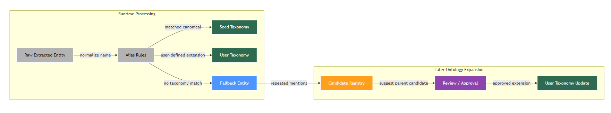

# 🏢 News Graph Pipeline - Architecture Document

이 문서는 `News Graph Pipeline` 프로젝트의 전체 시스템 아키텍처 및 핵심 모듈의 동작 원리를 설명합니다. 파편화된 비정형 뉴스 데이터를 수집하여 의미 있는 지식 그래프(Knowledge Graph)로 구조화하고, 이를 인터랙티브하게 탐색할 수 있는 엔드 투 엔드(End-to-End) 데이터 파이프라인 시스템을 구축하는 데 초점을 맞추고 있습니다.

---

## 🗺️ 지식 그래프 온톨로지

프로젝트에서 사용하는 Neo4j 노드/관계 스키마는 아래 온톨로지 다이어그램을 참고하세요. 현재 구조는 엔티티 타입 기반 저장 구조 위에 선택적 taxonomy 계층과 사용자 확장 레이어를 얹은 하이브리드 온톨로지입니다.

### 구조도


이 다이어그램은 "어떤 노드와 관계를 저장하는가"를 보여주는 구조도입니다.

### 운영 흐름도



운영 흐름도는 "추출된 엔티티가 어떤 과정을 거쳐 seed taxonomy, 사용자 taxonomy, fallback, 후보 레지스트리로 흘러가는가"를 보여줍니다. 구조도(`ontology.png`)는 저장 모델 설명용, 운영 흐름도(`ontology_operations.png`)는 taxonomy 운영 정책 설명용으로 역할을 분리합니다.

### 온톨로지 운영 흐름 읽는 법

- `Runtime Processing` 박스: 뉴스 기사에서 추출된 엔티티가 alias 규칙으로 먼저 정규화되고, seed taxonomy 또는 user taxonomy에 매칭되면 해당 canonical concept로 흡수됩니다.
- `Fallback Entity` 노드: taxonomy에 없는 주제라도 바로 버리지 않고, 일반 엔티티로 유지해 그래프가 계속 동작하도록 하는 안전장치입니다.
- `Later Ontology Expansion` 박스: fallback으로 남은 엔티티는 필요 시 후보 레지스트리에 누적할 수 있고, 이후 검토/승인을 거쳐 사용자 taxonomy로 편입될 수 있습니다. 이 후보 수집 기능은 설정으로 켜고 끌 수 있습니다.
- 즉, 이 흐름도의 핵심은 "taxonomy가 없어도 서비스는 동작하고, 필요할 때만 구조를 확장한다"는 운영 원칙입니다.

---

## 🤖 Graph RAG Agent Workflow (LangGraph)

프로젝트의 핵심 검색 엔진은 `LangGraph`를 통해 구성된 다중 경로(Multi-path) 에이전트 아키텍처를 가집니다. 사용자의 질문 의도에 따라 가장 적합한 검색 전략을 동적으로 선택합니다.


---

## 🏗️ 1. High-Level Architecture Overview

시스템은 유지보수성과 확장성을 보장하기 위해 각 역할이 명확히 분리된 **디커플링(Decoupling)** 아키텍처를 따르고 있습니다. 전반적인 데이터 흐름은 다음과 같습니다.

1. **Data Ingestion (크롤링):** 신뢰 언론사(화이트리스트) 기사만 선별 수집합니다. 수집 기간은 달력 일(日) 기준으로, 1일이면 '오늘', 5일이면 '오늘 포함 과거 5일'입니다. (최대 100일) 다만 `days_back`은 요청 범위이지 기사 확보를 보장하는 값은 아닙니다. 네이버 뉴스 Search API가 최신순 결과를 실질적으로 최대 1,000건까지만 제공하므로, 기사량이 많은 키워드는 긴 기간을 요청해도 실제 수집 데이터가 최근 며칠치에 집중될 수 있습니다.
2. **Watermark 기반 증분 처리:** 각 키워드별로 날짜별 마지막 수집 시각(Watermark)을 Neo4j에 저장합니다. 재검색 시 이미 수집 완료된 날짜는 건너뛰고, 부분 수집된 날짜(당일 등)는 해당 시각 이후 기사만 신규 수집합니다.
3. **Deduplication & Filtering:** TF-IDF + 코사인 유사도 기반으로 날짜별 유사 기사를 제거하고, 하루 최대 기사 수를 초과 시 균등 샘플링합니다.
4. **Article-level Embedding:** 각 기사를 독립적인 단위로 벡터 임베딩하여 `NewsArticle` 노드에 저장합니다. 이를 통해 기사 단위의 정밀한 벡터 검색이 가능합니다.
5. **Entity Resolution (정규화):** 추출된 엔티티의 동의어를 `entity_aliases.json`으로 표준화하고, 공통 seed taxonomy(`entity_taxonomy.json`)와 사용자 확장 taxonomy(`entity_taxonomy.user.json`)를 함께 적용합니다. taxonomy에 없는 엔티티도 평면 노드로 유지하며, 반복 출현 시 ontology 후보 레지스트리에 parent 추천 후보를 기록합니다. 관계 provenance(`article` / `taxonomy`)도 함께 보존합니다.
6. **Graph Construction (증분 적재):** 정제된 엔티티와 관계 데이터를 Neo4j에 **MERGE 방식으로 누적 적재**합니다. 기사와 엔티티를 `[:MENTIONS]` 관계로 직접 연결하고, taxonomy 관계는 별도 provenance와 함께 저장합니다.
7. **Visualization & Analytics (시각화 및 분석):** 날짜 필터를 그래프 데이터베이스 쿼리에 직접 반영하여, 선택한 기간 내 기사에서 추출된 관계만 그래프로 시각화합니다.
8. **Graph RAG 챗봇:** 자연어 질문을 받아 Vector / Text-to-Cypher / Hybrid 방식으로 지식 그래프를 검색합니다. 검색된 `NewsArticle` 노드에서 URL을 직접 추출하여 **[참조 링크 매핑 테이블]**을 생성하고 100% 정확한 출처 정보를 제공합니다.

---

## 📦 2. Core Modules & Directory Structure

### `src/configs/` (Layer 1: Config & Schema)

* **`schema.py`:** `Pydantic`을 활용하여 추출될 그래프 데이터의 스키마(`Entity`, `Relation`, `GraphData`)를 엄격하게 정의합니다.
  * 추출 대상 엔티티 타입: `Company`, `Industry`, `MacroEvent`, `Product`, `Technology`, `RiskFactor`
  * 관리형 관계 타입: `SUPPLIES_TO`, `COMPETES_WITH`, `BELONGS_TO`, `PART_OF`, `RELEASED`, `USES`, `EXPOSED_TO`, `BENEFITS_FROM`, `AFFECTS`, `OWNS`, `RELATED_TO`, `MENTIONS`
  * LLM 환각(Hallucination) 방지 및 정규화된 JSON 출력 강제
* **`settings.py`:** 파이프라인 전체에서 사용하는 **모든 튜닝 파라미터를 한 곳에서 관리**합니다.
  * LLM 모델명 (`LLM_MODEL`), 병렬 호출 수 (`LLM_MAX_WORKERS`), 배치 크기 (`BATCH_SIZE`)
  * semantic merge 사용 여부 (`ENABLE_ENTITY_SEMANTIC_MERGE`), semantic merge 임계값 (`ENTITY_SEMANTIC_MERGE_THRESHOLD`)
  * taxonomy 확장 사용 여부 (`ENABLE_TAXONOMY_ENRICHMENT`), seed taxonomy 경로 (`SEED_TAXONOMY_PATH`), 사용자 taxonomy 경로 (`USER_TAXONOMY_PATH`)
  * ontology 후보 수집 여부 (`ENABLE_ONTOLOGY_CANDIDATE_CAPTURE`, 기본값 비활성화), 후보 레지스트리 경로 (`ONTOLOGY_CANDIDATE_REGISTRY_PATH`)
  * parent 추천 시작 기준 (`ONTOLOGY_PARENT_SUGGESTION_MIN_COUNT`), 추천 최소 유사도 (`ONTOLOGY_PARENT_SUGGESTION_THRESHOLD`)
  * 페이지네이션 기준 (`DAYS_BACK_PER_PAGE`, `MAX_PAGES`)
  * 유사 기사 필터 (`MAX_ARTICLES_PER_DAY`, `SIMILARITY_THRESHOLD`)
  * 그래프 표시 설정 (`GRAPH_QUERY_LIMIT`, `GRAPH_HOP_DEPTH`)
* **`entity_aliases.json`:** 엔티티 동의어 매핑 규칙을 코드 외부의 JSON 파일로 관리합니다. 코드 수정 없이 새로운 매핑을 추가할 수 있습니다.
* **`entity_taxonomy.json`:** canonical 엔티티, 별칭, 상위 taxonomy 관계를 담는 공통 seed taxonomy입니다. 특정 산업/기업 중심이 아니라 여러 주제에서 재사용 가능한 공통 축만 유지합니다.
* **`entity_taxonomy.user.json`:** 사용자가 자유롭게 확장하는 taxonomy 레이어입니다. 특정 주제의 상위 개념, 별칭, 부모 관계는 이 파일에서 추가/수정하는 것을 기본 전략으로 합니다.
* **`data/ontology_candidates.json`:** ontology 후보 수집 기능을 활성화했을 때 taxonomy 미등록 엔티티 후보를 누적 기록하는 선택적 레지스트리입니다.

### `src/core/crawlers/` (Layer 2: Data Crawlers)

* **`base_provider.py`:** Bloomberg, Yahoo Finance, DART 등 다양한 데이터 프로바이더를 수용할 수 있도록 `fetch_data` / `cluster_data` 추상 인터페이스를 정의합니다.
* **`naver_news.py`:** 네이버 뉴스 API 구현체입니다. 주요 기능은 다음과 같습니다.
  * `ALLOWED_NEWS_DOMAINS`: 수집 허용 언론사 도메인 화이트리스트 (`chosun.com`, `yna.co.kr`, `hankyung.com` 등).
  * **달력 일(日) 기반 수집 범위:** `days_back=1`이면 오늘 0시부터, `days_back=5`이면 4일 전(오늘 포함 5일) 0시부터 수집을 시작합니다. 최대 100일까지 설정 가능합니다.
  * **수집 전략 선택:** `recent`는 `days_back / DAYS_BACK_PER_PAGE` 기반으로 필요한 페이지만 추정해서 빠르게 조회하고, `coverage`는 네이버 API 허용 한도(`NAVER_NEWS_API_MAX_PAGES`, 현재 10페이지)까지 조회해 요청 시작일 도달 가능성을 최대화합니다.
  * **기간 보장 한계:** 현재 구조는 "최신순 검색 결과를 페이지네이션으로 가능한 만큼 가져온 뒤, 그 안에서 `days_back` 범위만 남기는 방식"입니다. 즉 `days_back=30`은 30일치 기사 보장이 아니라 30일 범위 필터이며, 최신 기사 쏠림이 심한 키워드에서는 API 상한에 먼저 걸릴 수 있습니다.
  * **워터마크 기반 증분 처리:** 애플리케이션(`app.py`)에서 이미 수집된 날짜의 정확한 시각이 전달되면, 그 시각 이후에 발행된 기사만 신규 수집합니다.
  * **커버리지 진단 로그:** 수집 후 `last_fetch_stats`에 `oldest_seen_date`, `requested_start_date`, `coverage_complete`, `hit_api_page_limit`를 남겨, "요청 기간 전체를 실제로 내려갔는지"를 UI에서 즉시 알 수 있습니다.
  * `filter_similar_articles()`: 날짜별로 기사를 묶고, 제목 TF-IDF 코사인 유사도 ≥ `SIMILARITY_THRESHOLD`(기본 0.5)인 기사를 중복으로 판별합니다. 중복 제거 후에도 하루 `MAX_ARTICLES_PER_DAY`(기본 100건) 초과 시 균등 샘플링합니다.
  * `cluster_data(batch_size=10)`: 허용 도메인 기사만 포함하고 영문 기사를 제외한 후, 10개씩 묶어 하나의 텍스트 배치(Batch)로 병합합니다. 각 기사에는 `[Article_1]`~`[Article_N]` 형태의 고유 ID를 부여하여 LLM이 출처를 명확히 추적할 수 있도록 합니다.
  * `get_article_metadata()`: URL / 제목 / 발행일 메타데이터를 추출하여 Neo4j `NewsArticle` 노드 저장에 활용합니다.

### `src/core/utils/` (Layer 3: Data Processing & Entity Resolution)

* **`entity_resolution.py`:** 데이터의 파편화를 막기 위한 핵심 모듈입니다. 다양한 형태로 등장하는 엔티티를 하나의 일관된 표준어로 정규화합니다.
  * alias 기반 정규화(`entity_aliases.json`)와 taxonomy 기반 canonical entity 확장(`entity_taxonomy.json`, `entity_taxonomy.user.json`)을 함께 수행합니다.
  * `GOOGLE_API_KEY`가 설정된 경우 선택적으로 임베딩 기반 semantic merge를 사용해 taxonomy canonical entity로 병합할 수 있습니다.
  * taxonomy에 없는 주제라도 엔티티를 제거하지 않고 fallback 노드로 유지합니다.
  * taxonomy 미등록 엔티티는 기본적으로 fallback 노드로 유지됩니다. 필요 시 ontology 후보 수집 기능을 활성화하면 별도 레지스트리에 누적하고, 반복 출현 시 parent 후보를 제안할 수 있습니다.
  * 기사 기반 관계에는 `source_article`, `source_url`, `article_id`, `provenance=article`을 보존하고, taxonomy 관계에는 `provenance=taxonomy`를 기록합니다.

### `src/graphs/` (Layer 4: Graph Database & RAG)

* **`neo4j_manager.py`:** Neo4j 적재를 담당하는 핵심 클래스입니다.
  * `get_keyword_watermarks(keyword)`: 키워드별 날짜별 마지막 수집 시각(Watermark)을 JSON 문자열로 반환합니다. 증분 처리의 기준점으로 사용됩니다.
  * `update_keyword_watermarks(keyword, watermarks)`: 수집이 완료된 기사의 실제 발행일을 기준으로 날짜별 워터마크를 갱신합니다. **실제로 기사를 수집한 날짜만** 업데이트하여 미래 재검색 시 누락이 발생하지 않도록 합니다.
  * `upsert_articles(keyword, articles)`: 기사를 `NewsArticle` 노드로 저장하고 `Keyword` 노드와 연결합니다.
  * `load_graph_data(graph_data, batch_text)`: 기사별 텍스트를 개별적으로 임베딩하여 `NewsArticle`에 저장하고, 추출된 엔티티와 관계를 `[:MENTIONS]` 및 엔티티 간 관계로 직접 연결합니다. taxonomy 관계도 provenance와 함께 적재합니다.
  * `create_vector_index()`: `NewsArticle` 노드의 임베딩을 저장하는 벡터 인덱스(`article_embedding`, 3072차원)를 생성합니다.
* **`state.py`:** LangGraph에서 사용하는 `AgentState`를 정의합니다. 질문, 라우팅 결정, 추출된 엔티티, Cypher 쿼리 및 결과, 대화 기록(`chat_history`), text2cypher 실패 시 즉시 반환할 에러 메시지(`final_answer`), 그리고 **기사 ID와 URL 매핑 테이블(`source_links`)**을 관리합니다.
* **`hybrid_rag.py`:** `router`를 필두로 Vector / Text-to-Cypher / Hybrid(Entity-based) 3가지 검색 경로를 가진 LangGraph 기반 RAG 에이전트입니다. `MemorySaver`를 통해 대화 기록을 보존하며, **text2cypher 경로는 retriever 결과에 따라 `generator` 또는 `END`로 바로 분기하는 최소 구조를 사용합니다.**

### `src/nodes/` (Layer 4-1: RAG Retriever & Generator)

* **`router.py`:** 사용자의 자연어 질문을 분석하여 어떤 검색 경로(`vector`, `text2cypher`, `vector_cypher`)를 사용할지 결정하는 분류기(Classifier) 노드입니다.
* **`retriever.py`:** RAG 검색을 수행하는 3개의 노드를 포함합니다. 모든 리트리버는 검색된 기사(`NewsArticle`)의 본문 텍스트와 URL을 Neo4j에서 직접 가져와 `_prepare_search_context`를 통해 전역적으로 고유한 번호를 매기고 매핑 테이블을 생성합니다.
  * `vector_retriever_node`: `article_embedding` 벡터 인덱스를 사용해 기사 단위로 검색하고, `NewsArticle`의 URL을 함께 리턴합니다.
  * `text2cypher_retriever_node`: 공식 `neo4j_graphrag`의 `Text2CypherRetriever`를 사용해 자연어 → Cypher 변환과 조회를 수행합니다. 실행 직전에는 driver proxy에서 `$current_keyword` 범위 강제, read-only 검사, `EXPLAIN` 문법 검사를 적용해 안전하게 쿼리합니다. 검증에 실패하면 재시도 없이 즉시 에러 메시지를 반환합니다. 관계형 추론이 필요한 질문에 유리합니다.
  * `vector_cypher_retriever_node`: vector-first Hybrid 검색. 먼저 `article_embedding` 인덱스로 관련 기사를 찾고, 그 기사 주변의 `MENTIONS` 엔티티와 엔티티 관계를 Cypher로 확장하여 리턴합니다.
* **`generator.py`:** 검색된 컨텍스트와 **[참조 링크 매핑 테이블]**을 바탕으로 답변을 생성합니다.
  * 각 기사에 새로 부여된 고유 ID(`[Article_1]`~`[Article_N]`)를 활용하여 각 문장 끝에 출처를 표기합니다.
  * **정밀 출처 표기:** LLM은 제공된 매핑 테이블을 참고하여 HTML 링크(`<a href="..." target="_blank">[출처]</a>`)를 답변에 직접 삽입함으로써 정보의 투명성을 극대화합니다.
  * ⚠️ `text2cypher_retriever`가 `final_answer`를 설정한 경우 `generator`는 실행되지 않고 종료합니다.

### `apps/gui/` (Layer 5: User Interface & Analytics)

* **`app.py`:** Streamlit과 Pyvis를 활용하여 구축된 대화형 그래프 시각화 대시보드입니다.
  * **수집 전략 UI:** 기본값은 `coverage`이며, 사용자는 `빠른 수집(recent)`과 `범위 우선 수집(coverage)` 중 하나를 선택할 수 있습니다.
  * **미도달 경고:** `coverage` 전략에서도 API 페이지 상한 때문에 요청 시작일까지 내려가지 못하면, UI 로그에 "실제 API 조회 최하단 날짜"와 함께 범위 미충족 경고를 표시합니다.
  * **레이아웃:** 상단에 지식 그래프, 하단에 Graph RAG 채팅창을 수직 배치합니다.
  * **증분 파이프라인:** `[0/4] 워터마크 조회 → [1/4] 신규 기사 수집 → [2/4] LLM 추출 → [3/4] 정규화 → [4/4] 누적 적재`
  * **달력 일(日) 기반 수집:** 1일=오늘, 5일=오늘 포함 과거 5일 기준으로 직관적으로 수집 범위를 설정합니다. (최대 100일)
  * **엄격한 날짜 필터 기반 그래프:** 날짜 필터(Date Picker)를 변경하면 해당 기간 내 기사에서 추출된 관계만 Neo4j에 직접 쿼리하여 그래프에 표시합니다. (날짜 외 조건으로 인한 오염 없음)
  * **다중 필터 기반 뷰:** 노드/엣지 유형 필터, `NetworkX` 기반 PageRank 상위 N% 필터
  * **채팅 내역 정렬:** 질문-답변을 한 세트로 묶어, 최신 대화 세트가 위에 표시됩니다.
  * **정밀 출처 링크:** RAG 답변에서 실제로 인용된 기사의 URL만 `🔗 참조 뉴스 링크` 섹션으로 자동 첨부합니다.

---

## ⚙️ 3. 파라미터 관리 (`src/configs/settings.py`)

모든 튜닝 가능한 파라미터는 `settings.py` 한 곳에서 관리됩니다.

| 파라미터 | 기본값 | 설명 |
|---|---|---|
| `LLM_MODEL` | `gemini-2.5-flash` | LLM 모델명 |
| `LLM_MAX_WORKERS` | `5` | 병렬 LLM API 호출 수 (ThreadPoolExecutor) |
| `BATCH_SIZE` | `10` | LLM 1회 호출당 기사 묶음(배치) 크기. 기사별 `[Article_N]` ID 부여로 출처 추적 강화 |
| `ENABLE_ENTITY_SEMANTIC_MERGE` | `True` | taxonomy canonical entity에 대해 임베딩 기반 semantic merge를 사용할지 여부 |
| `ENTITY_SEMANTIC_MERGE_THRESHOLD` | `0.9` | semantic merge 후보를 canonical entity로 병합할 최소 유사도 |
| `ENABLE_TAXONOMY_ENRICHMENT` | `True` | seed taxonomy와 user taxonomy를 함께 적용할지 여부 |
| `SEED_TAXONOMY_PATH` | `src/configs/entity_taxonomy.json` | 공통 축을 담는 seed taxonomy 파일 경로 |
| `USER_TAXONOMY_PATH` | `src/configs/entity_taxonomy.user.json` | 사용자 확장 taxonomy 파일 경로 |
| `ENABLE_ONTOLOGY_CANDIDATE_CAPTURE` | `False` | taxonomy 미등록 엔티티 후보를 수집할지 여부 |
| `ONTOLOGY_CANDIDATE_REGISTRY_PATH` | `data/ontology_candidates.json` | ontology 후보 레지스트리 파일 경로 |
| `ONTOLOGY_PARENT_SUGGESTION_MIN_COUNT` | `3` | parent 후보 추천을 시작하는 최소 반복 출현 횟수 |
| `ONTOLOGY_PARENT_SUGGESTION_THRESHOLD` | `0.78` | parent 후보 추천 시 사용하는 최소 유사도 |
| `DEFAULT_DAYS_BACK` | `1` | UI 기본 수집 기간(일) |
| `DEFAULT_COLLECTION_STRATEGY` | `coverage` | UI 기본 수집 전략. 긴 기간 요청 시 범위 도달 가능성을 우선 확보 |
| `DAYS_BACK_PER_PAGE` | `3` | 페이지당 기준 일수 (3일=1페이지=100건) |
| `MAX_PAGES` | `1000` | 내부 최대 요청 페이지 설정값. 실제 호출은 API 한도와 전략에 따라 추가 제한됨 |
| `NAVER_NEWS_API_MAX_PAGES` | `10` | 네이버 뉴스 Search API 실질 상한. `start` 기반 최신순 조회는 최대 1,000건 |
| `MAX_ARTICLES_PER_DAY` | `100` | 날짜별 최대 기사 수 (유사 필터 후) |
| `SIMILARITY_THRESHOLD` | `0.5` | 제목 TF-IDF 코사인 유사도 임계값 |
| `GRAPH_QUERY_LIMIT` | `500` | Neo4j 조회 최대 엣지 수 |
| `GRAPH_HOP_DEPTH` | `3` | 검색어 기준 표시 홉(Hop) 깊이 |
| `PAGERANK_DEFAULT_TOP` | `50` | 그래프 표시 시 PageRank 기준 상위 % |

---

## 🗄️ 4. Neo4j 데이터 스키마

```
(:Keyword {name, last_updated})
    │
    └──[:HAS_ARTICLE]──▶ (:NewsArticle {id=url, url, title, published_at, keyword, text, embedding})
                                │
                                └──[:MENTIONS]──▶ (:Entity / :Company / :Industry / :MacroEvent / :Product / :Technology / :RiskFactor)
                                                        │
                                              [:RELATION_TYPE {description, source_article, source_url, article_id, provenance}]
                                                        ▼
                                                   (:Entity)
```

| 노드 | 속성 | 역할 |
|------|------|------|
| `Keyword` | `name`, `last_updated`, `watermarks` | 검색어 추적, 날짜별 마지막 수집 시각(Watermark) 기록 |
| `NewsArticle` | `id`(PK=url), `url`, `title`, `published_at`, `keyword`, `text`, `embedding` | 기사 중복 방지 + 증분 기준점 + 벡터 검색의 단위 |
| `Entity` 계열 | `id`(PK=name), `name` | `Company`, `Industry`, `MacroEvent`, `Product`, `Technology`, `RiskFactor` 타입 포함. taxonomy 관계와 provenance를 함께 보존하며 키워드 무관 공유 → 크로스-키워드 분석 |

---

## 📐 5. 엔티티 허용/제거 기준

온톨로지 정제의 기본 원칙은 "기사에서 반복적으로 재사용 가능한 개념은 남기고, 문장 설명이나 맥락 의존 표현은 제거한다"입니다. 이 기준은 특정 산업이나 특정 기업에 치우치지 않도록 도메인 중립적으로 유지합니다.

### 5-1. 유지하는 엔티티

- 고유한 기업, 기관, 조직, 브랜드, 제품, 서비스, 기술, 산업, 리스크, 거시 이벤트처럼 비교적 안정적인 명칭
- 기사 제목이 달라져도 같은 개체로 재사용 가능한 canonical concept
- taxonomy 상에서 상위 개념이나 분류 기준으로 쓰이는 구조적 노드
- 다른 기사나 다른 키워드에서도 같은 의미로 재참조될 수 있는 개념

### 5-2. 제거하는 엔티티

- 문장 조각이나 서술형 표현
- 단순 평가, 전망, 기대, 우려처럼 맥락이 없으면 의미가 약한 추상 표현
- "기술 기업", "관련 산업", "주요 업체"처럼 지나치게 일반적인 집합 명사
- 번역 흔적이 남은 영어 설명문이나 설명 중심 명사구
- 지나치게 긴 복합 명사구, 동사성이 강한 표현, 기사 한 문맥에서만 성립하는 설명

### 5-3. 경계 사례 처리

- `시장`, `업계`, `생태계`, `밸류체인`처럼 추상도가 높은 표현은 기사 직접 엔티티로는 보수적으로 다루고, 필요하면 taxonomy 상위 개념으로만 유지합니다.
- 제도, 정책, 국가/지역, 질환/적응증처럼 현재 타입 체계에 완전히 들어맞지 않는 개념은 우선 가장 가까운 기존 타입 또는 일반 `Entity`로 처리하고, 반복적으로 중요성이 확인되면 별도 타입 추가 후보로 검토합니다.
- 기사 출처에서 직접 추출된 엔티티와 taxonomy 확장으로 추가된 구조적 개념은 `provenance`로 구분합니다.

### 5-4. 기사 기반 엔티티와 taxonomy 기반 개념의 역할 분리

- 기사 기반 엔티티는 현재 검색어와 연결된 `NewsArticle`에서 직접 언급된 개체입니다.
- taxonomy 기반 개념은 기사에 그대로 등장하지 않아도, 분류와 상하위 구조를 표현하기 위해 추가되는 보조 개념입니다.
- 시각화와 질의응답에서는 기사 기반 엔티티를 우선하고, taxonomy 기반 개념은 구조 설명과 범주 정리에 사용합니다.

### 5-5. 다음 정제 단계

이 기준을 바탕으로 다음 단계에서는 "generic 개념 노드를 taxonomy로만 남길지, 기사 직접 엔티티에서도 허용할지"를 더 구체적으로 정리합니다. 즉, 이번 섹션은 엔티티 허용/제거의 상위 원칙이고, 다음 정책은 generic node 세부 처리 규칙입니다.

---

## 🧭 6. Generic Node 정책

generic node 정책의 목적은 "분석 가치가 낮은 일반 집합 명사"와 "분류 구조에 필요한 상위 개념"을 분리하는 것입니다. 같은 추상적 표현이라도 기사 직접 엔티티인지, taxonomy 구조 노드인지에 따라 처리 방식이 달라집니다.

### 6-1. 완전히 제거하는 generic node

아래와 같은 표현은 기사에서 직접 추출되더라도 기본적으로 제거합니다.

- `주요 기업`, `주요 업체`, `관련 산업`, `관련 업계`
- 접두어와 집합 명사만으로 구성된 표현
- 기사 문맥이 없으면 의미가 성립하지 않는 broad category phrase

이 범주는 개별 개체를 가리키지 않고, 분류 체계에서도 독립 노드로서 분석 가치가 낮기 때문입니다.

### 6-2. taxonomy로만 유지하는 generic node

아래와 같은 표현은 기사 직접 엔티티로는 보수적으로 다루되, taxonomy 구조를 위해서는 유지할 수 있습니다.

- 상위 제품군, 상위 기술군, 상위 산업군
- 구조적 부모 노드로 쓰이는 분류 개념
- 여러 기사에서 반복 재사용되는 canonical category

이 경우에는 기사 본문에서 뽑힌 표현을 그대로 유지하기보다, canonical concept로 정규화한 뒤 taxonomy provenance로 연결합니다.

### 6-3. 기사 엔티티로도 허용하는 generic-like 개념

다음 조건을 만족하면 추상도가 다소 높아도 기사 엔티티로 유지합니다.

- 단순 집합 명사가 아니라 분석 대상 그 자체로 자주 언급되는 개념
- 기사 간 재사용 가능성이 높고, 다른 노드와의 관계가 안정적으로 형성되는 개념
- 리스크, 거시 이벤트, 기술 테마처럼 문맥이 바뀌어도 의미가 크게 흔들리지 않는 개념

즉, generic해 보이더라도 "분석 축"으로 반복 등장하는 개념은 남깁니다.

### 6-4. 처리 우선순위

generic node는 아래 순서로 처리합니다.

1. alias 또는 taxonomy canonical entity로 먼저 정규화
2. canonical concept로 흡수되면 해당 개념으로 유지
3. canonical concept로 흡수되지 않고 broad category phrase로 남으면 제거
4. 구조적 상위 개념으로만 필요한 경우 taxonomy node로 유지

이 우선순위 덕분에 "기사 직접 엔티티"와 "taxonomy 보조 개념"의 역할이 섞이지 않도록 제어할 수 있습니다.

### 6-5. 현재 구현과의 대응

- `entity_resolution.py`는 명백한 generic 집합 명사를 제거합니다.
- taxonomy에 등록된 canonical concept와 alias는 generic 표현이어도 우선 정규화 대상이 됩니다.
- 따라서 동일 표현이라도 "taxonomy에 흡수되는 경우"와 "그냥 broad phrase로 남는 경우"의 결과가 달라질 수 있습니다.

이 정책을 기준으로 다음 단계에서는 타입 체계 2차 보강 여부를 검토합니다.

---

## 🔗 7. 관계 Ontology 기준

관계 ontology의 목표는 "연결되어 있다"는 사실만 남기는 것이 아니라, 연결의 성격을 가능한 한 관리형 타입으로 표현하는 것입니다. 따라서 `RELATED_TO`는 허용하되, 마지막 fallback으로만 사용합니다.

### 7-1. 관리형 관계 타입의 기본 역할

- `SUPPLIES_TO`: 공급, 납품, 제공 관계
- `COMPETES_WITH`: 경쟁 또는 대체 관계
- `BELONGS_TO`: 특정 개체가 상위 산업/범주/분류에 속하는 관계
- `PART_OF`: 상하위 개념, 구성 관계, 제품군/기술군의 포함 관계
- `RELEASED`: 제품, 서비스, 기능, 버전의 출시 또는 공개
- `USES`: 어떤 개체가 기술, 플랫폼, 시스템, 방법론을 활용하는 관계
- `EXPOSED_TO`: 리스크, 거시 변수, 외부 충격에 노출되는 관계
- `BENEFITS_FROM`: 특정 개체가 기술, 정책, 외부 환경으로부터 수혜를 받는 관계
- `AFFECTS`: 거시 이벤트, 리스크, 기술 변화가 개체에 영향을 주는 관계
- `OWNS`: 소유, 지배, 보유 관계
- `RELATED_TO`: 위 기준으로 명확히 떨어지지 않지만, 기사에서 관련성이 분명한 경우에만 쓰는 fallback

### 7-2. `BELONGS_TO`와 `PART_OF`의 구분

- `BELONGS_TO`는 "어떤 개체가 어떤 분류/산업/범주에 속한다"는 소속 관계에 사용합니다.
- `PART_OF`는 "어떤 개체가 더 큰 개체의 구성 요소이거나 하위 개념이다"라는 포함 관계에 사용합니다.

즉, 소속과 포함을 분리하는 것이 핵심입니다.

### 7-3. `AFFECTS`, `EXPOSED_TO`, `BENEFITS_FROM`의 구분

- `AFFECTS`: 외부 요인이나 변화가 어떤 개체에 영향을 미치는 경우
- `EXPOSED_TO`: 어떤 개체가 리스크나 거시 변수에 노출되는 경우
- `BENEFITS_FROM`: 어떤 개체가 외부 변화나 기술/정책으로부터 수혜를 얻는 경우

이 세 관계는 모두 "영향" 계열이지만, 영향의 방향과 의미가 다릅니다.

### 7-4. `RELATED_TO` 사용 원칙

`RELATED_TO`는 다음 조건을 동시에 만족할 때만 사용합니다.

- 기사에서 두 엔티티의 관련성이 분명하게 언급됨
- 관리형 관계 타입 어느 하나로도 무리 없이 치환하기 어려움
- 관계를 억지로 특정 타입으로 해석할 경우 의미 왜곡 가능성이 있음

즉, `RELATED_TO`는 안전장치이지 기본값이 아닙니다.

### 7-5. 방향성 원칙

- `SUPPLIES_TO`, `RELEASED`, `USES`, `EXPOSED_TO`, `BENEFITS_FROM`, `AFFECTS`, `OWNS`는 방향성이 있는 관계로 취급합니다.
- `COMPETES_WITH`는 의미상 대칭이지만, 저장 시에는 한 방향으로만 기록되더라도 해석상 경쟁 관계로 봅니다.
- 방향성이 애매한 경우에는 기사의 서술 방향보다 의미 보존이 우선이며, 억지 방향 지정이 필요하면 `RELATED_TO`로 낮춰도 됩니다.

### 7-6. 현재 구현과의 대응

- `schema.py`는 관리형 관계 타입 집합을 정의하고, 추출 프롬프트에서 우선 사용하도록 유도합니다.
- `entity_resolution.py`는 관계 표현을 정규화하고, 관리형 타입에 없는 값은 `RELATED_TO`로 낮춥니다.
- 따라서 품질 개선의 목표는 "새 관계를 무한정 늘리는 것"보다 "`RELATED_TO` 비율을 줄이되 의미 왜곡은 피하는 것"입니다.

이 기준을 바탕으로 다음 단계에서는 taxonomy 노출 정책을 정리합니다.

---
